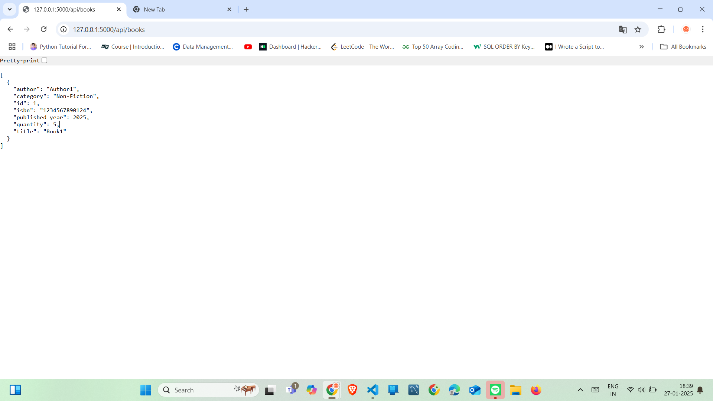

# *Library Management System API*

## *Overview*
The Library Management System API is a Python-based RESTful API that provides functionalities for managing a library, including book management, user management, and book transactions (borrow and return). It uses Flask for the backend, SQLite as the database, and SQLAlchemy as the ORM.

---

## *Features*
### *Book Management*
- Add new books
- Update book details
- Delete books
- List all books with optional filters
- Search books by title, author, or ISBN

### *User Management*
- Register new users (Admin or Regular Users)
- Update user information
- Delete users
- List all users (Admin only)

### *Book Checkout and Return*
- Check out books (decrease book quantity)
- Return books (increase book quantity)
- View borrowed books by user
- View overdue books (Admin only)

---


## *Setup Instructions*

### *1. Clone the Repository*
```bash
git clone <repository-url>
cd library-management
```

### *2. Create a Virtual Environment*
```bash
python -m venv venv
source venv/bin/activate  # On Windows: venv\Scripts\activate
```

### *3. Install Dependencies*
```bash
pip install -r requirements.txt
```
### *4. Configure Environment Variables*
```bash
Create a .env file in the project root and add the following:

SQLALCHEMY_DATABASE_URI=sqlite:///library.db
JWT_SECRET_KEY=your-secret-key

Replace your-secret-key with a secure key. You can generate it using:

python -c "import secrets; print(secrets.token_hex(32))"
```

### *5. Run the Application*
```bash
python app.py
```
The API will be available at http://127.0.0.1:5000/.

---

## *6. Screenshots*


