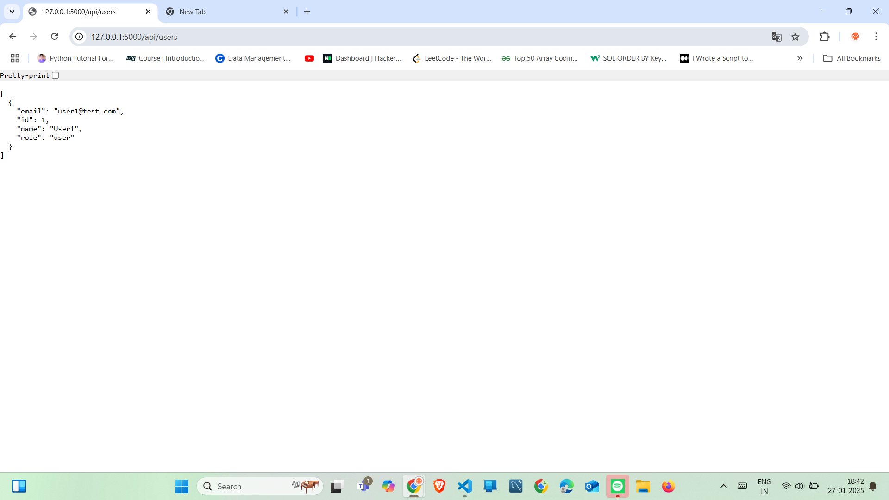

 
# *Library Management System API*

## *Overview*
The Library Management System API is a Python-based RESTful API that provides functionalities for managing a library, including book management, user management, and book transactions (borrow and return). It uses Flask for the backend, SQLite as the database, and SQLAlchemy as the ORM.

---

## *Features*
### *Book Management*
- Add new books
- Update book details
- Delete books
- List all books with optional filters
- Search books by title, author, or ISBN

### *User Management*
- Register new users (Admin or Regular Users)
- Update user information
- Delete users
- List all users (Admin only)

### *Book Checkout and Return*
- Check out books (decrease book quantity)
- Return books (increase book quantity)
- View borrowed books by user
- View overdue books (Admin only)

---

## * Screenshots*

### *1. Books API Output* 

### *2. Users API Output*

---

## * Sources*

1. Youtube
2. Flask Documentation
3. Sqlite Documentation
